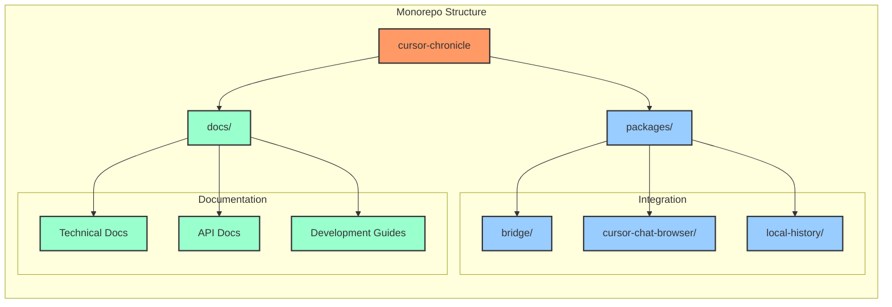

# Cursor Chronicle

A unified integration of cursor-chat-browser and local-history, enhancing the development experience with rich context and seamless history tracking.

## Architecture Overview


## Repository Structure



## Data Flow


## Integration Approaches


## Development Workflow


## Quick Start

1. Clone the repository:
```bash
git clone https://github.com/yourusername/cursor-chronicle.git
cd cursor-chronicle
```

2. Initialize submodules:
```bash
git submodule update --init --recursive
```

3. Install dependencies:
```bash
npm install
```

4. Start development:
```bash
npm run dev
```

## Integration Strategy

The project follows a modular integration approach:

1. **Fork Management**
   - Maintain clean forks of upstream repositories
   - Regular sync with upstream changes
   - Clear separation of custom features

2. **Integration Layer**
   - Unified API surface
   - Shared state management
   - Consistent UI/UX

3. **Feature Development**
   - Isolated feature modules
   - Progressive enhancement
   - Backward compatibility

## Documentation Structure

- `/docs/technical/` - Architecture and design documents
- `/docs/api/` - API documentation and examples
- `/docs/development/` - Development guides and workflows
- `/docs/decisions/` - Architecture Decision Records (ADRs)

## Contributing

See [CONTRIBUTING.md](./CONTRIBUTING.md) for detailed guidelines.

## License

MIT - See [LICENSE](./LICENSE) for details. 