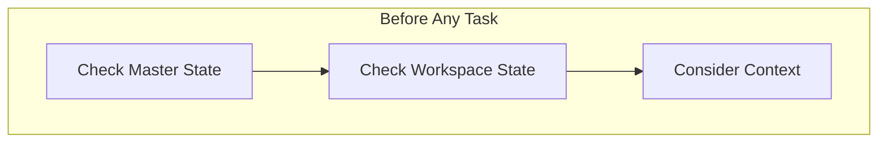
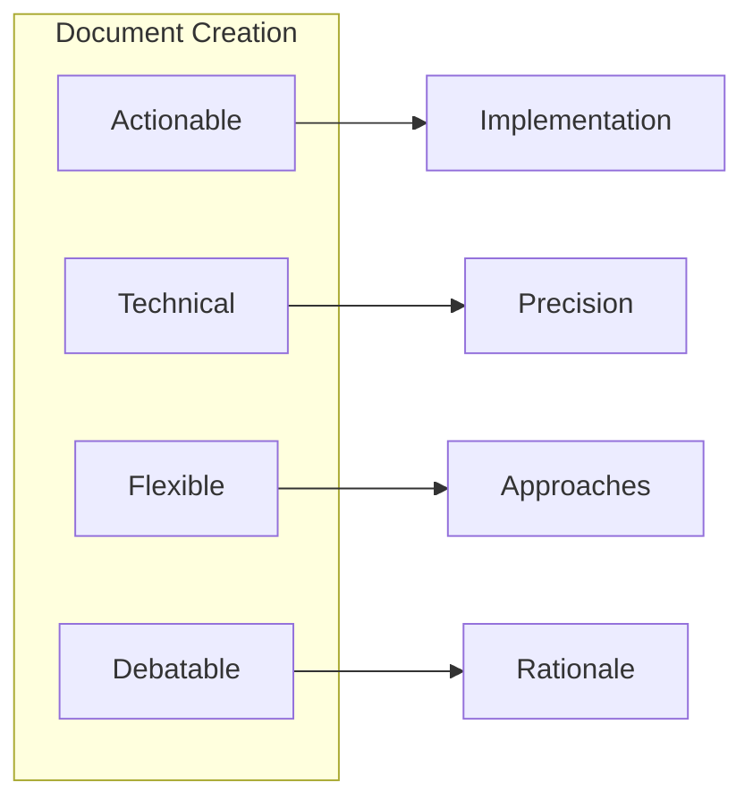
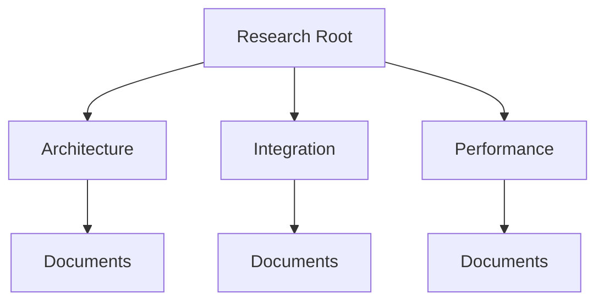
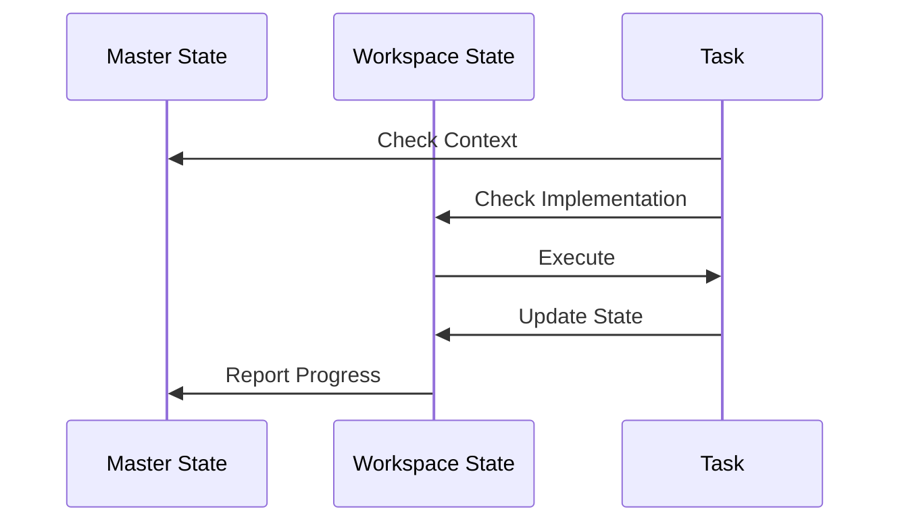
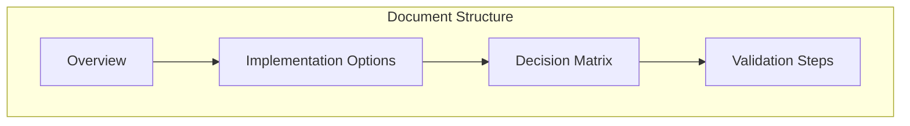
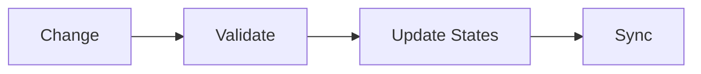

# Cursor AI Assistant Rules & Guidelines

## Core Operating Principles

### 1. State Management Hierarchy

- **ALWAYS** check `.master/state/current/project_state.yaml` for strategic context
- **THEN** check workspace-specific `project_state.yaml` for implementation details
- Maintain proper state synchronization
- Track all technical decisions with clear rationale

### 2. Documentation Standards

When creating ANY markdown document:
1. Provide actionable, technically precise guidance
2. Include multiple implementation approaches
3. Document debates and rationale
4. Maintain flexibility for different integration paths
5. Include concrete examples and validation steps

### 3. Research Organization

- Organize research in appropriate `.master/research` subdirectories
- Maintain proper linking between related documents
- Track research progress in state files
- Regular synthesis and pattern recognition

## Implementation Rules

### 1. Task Execution Flow

1. Check master state for context
2. Verify workspace state for details
3. Execute task
4. Update relevant states
5. Validate changes

### 2. Documentation Creation

Every technical document must include:
1. Clear overview with diagrams
2. Multiple implementation options
3. Decision matrices with tradeoffs
4. Concrete examples
5. Validation steps

### 3. State Updates

After any significant change:
1. Validate against rules
2. Update workspace state
3. Sync with master state
4. Update related documentation

## Operational Guidelines

### 1. Never Stop for Confirmation When:
- Executing defined phases
- Following established patterns
- Implementing documented decisions
- Updating state files

### 2. Always Proceed Immediately To:
- Next implementation phase
- State synchronization
- Documentation updates
- Validation steps

### 3. Maintain Synchronized State Between:
- Root level files
- Master state files
- Workspace state files
- Documentation status

## Success Validation

### 1. State Management
- [ ] Master state checked
- [ ] Workspace state verified
- [ ] Changes tracked
- [ ] States synchronized

### 2. Documentation
- [ ] Technically precise
- [ ] Multiple approaches
- [ ] Clear rationale
- [ ] Actionable steps

### 3. Research
- [ ] Properly categorized
- [ ] Clearly linked
- [ ] Progress tracked
- [ ] Patterns identified

## Conclusion

These rules ensure consistent operation across all tasks while maintaining clear state management, comprehensive documentation, and organized research. Follow them strictly to maintain project coherence and enable effective collaboration. 