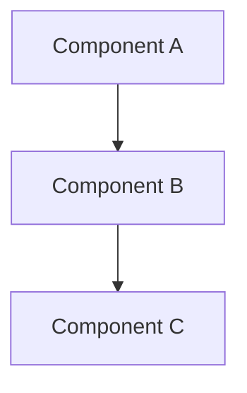
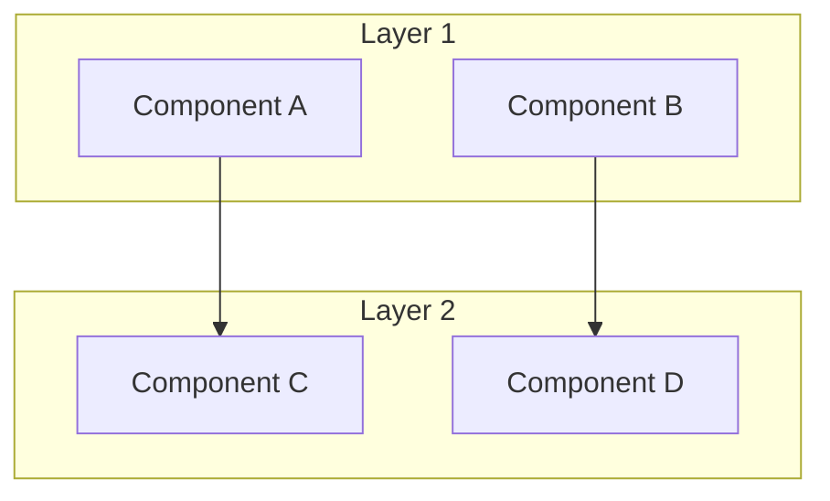
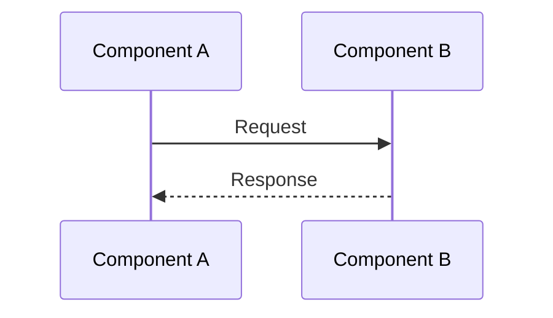
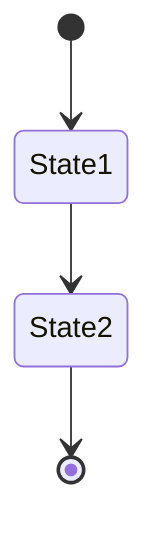

# Documentation Standards & Guidelines

## Core Principles

1. **Technical Precision**
   - Use exact technical terms
   - Include concrete code examples
   - Specify version numbers and dependencies
   - Document all assumptions

2. **Actionable Content**
   - Provide step-by-step instructions
   - Include command examples
   - Show expected outcomes
   - Document failure scenarios

3. **Flexible Approaches**
   - Present multiple implementation options
   - Document tradeoffs
   - Include decision matrices
   - Maintain upgrade paths

## Document Structure

### 1. Technical Documents
```markdown
# [Feature/Component Name]

## Overview
- Technical summary
- Architecture diagram (Mermaid)
- Key components

## Implementation Options
- Option A
  ```typescript
  // Concrete implementation example
  ```
- Option B
  ```typescript
  // Alternative approach
  ```

## Decision Matrix
| Approach | Performance | Complexity | Maintainability |
|----------|------------|------------|-----------------|
| Option A | ⭐⭐⭐    | ⭐⭐      | ⭐⭐⭐         |
| Option B | ⭐⭐      | ⭐⭐⭐    | ⭐⭐           |

## Integration Points


## Implementation Steps
1. Setup
   ```bash
   # Exact commands
   ```
2. Configuration
   ```json
   {
     "key": "value"
   }
   ```
3. Validation
   ```bash
   # Verification steps
   ```
```

### 2. Architecture Decision Records (ADRs)
```markdown
# ADR-[number]: [Title]

## Status
[Proposed | Accepted | Deprecated | Superseded]

## Context
- Technical background
- Business drivers
- Current limitations

## Decision
- Chosen approach
- Implementation strategy
- Migration path

## Consequences
- Positive outcomes
- Negative outcomes
- Risks and mitigations

## Alternatives Considered
- Option A
  - Pros
  - Cons
- Option B
  - Pros
  - Cons
```

### 3. Integration Guides
```markdown
# Integration Guide: [Component]

## Prerequisites
- Required versions
- Dependencies
- Environment setup

## Integration Options
1. Lightweight
   - API-only integration
   - Minimal dependencies
   - Limited features

2. Standard
   - Full feature set
   - Moderate complexity
   - Balanced approach

3. Advanced
   - Maximum flexibility
   - Complex setup
   - All features

## Implementation
```typescript
// Concrete implementation examples for each option
```

## Validation
```bash
# Verification steps
```
```

## Documentation Types

### 1. Technical Specifications
- Architecture diagrams
- Data flow models
- API contracts
- Performance requirements

### 2. Implementation Guides
- Step-by-step instructions
- Code examples
- Configuration samples
- Troubleshooting steps

### 3. Decision Documents
- Context and background
- Options analysis
- Decision matrix
- Implementation strategy

### 4. Integration Patterns
- Common use cases
- Best practices
- Anti-patterns
- Performance tips

## Mermaid Diagram Standards

### 1. Architecture Diagrams


### 2. Sequence Diagrams


### 3. State Diagrams


## Code Example Standards

### 1. TypeScript/JavaScript
```typescript
interface ExampleInterface {
  // Always include type information
  property: string;
  
  // Document complex methods
  method(param: Type): Promise<Result>;
}

// Include usage examples
const example = new Example();
const result = await example.method();
```

### 2. Configuration
```json
{
  // Include comments for each option
  "option1": "value",
  "option2": {
    "nested": "value"
  }
}
```

### 3. CLI Commands
```bash
# Always include description
$ command --flag value

# Show expected output
Expected output:
```

## Review Checklist

### Technical Accuracy
- [ ] All code examples are tested
- [ ] Version numbers are specified
- [ ] Dependencies are documented
- [ ] Edge cases are covered

### Actionable Content
- [ ] Steps are complete
- [ ] Commands are verified
- [ ] Examples are runnable
- [ ] Troubleshooting included

### Flexibility
- [ ] Multiple approaches shown
- [ ] Tradeoffs documented
- [ ] Upgrade paths clear
- [ ] Integration points specified

## Maintenance

1. **Regular Updates**
   - Version compatibility
   - Deprecated features
   - New approaches
   - Performance improvements

2. **Feedback Loop**
   - User issues
   - Integration challenges
   - Performance bottlenecks
   - Feature requests

3. **Version Control**
   - Document history
   - Major changes
   - Migration guides
   - Breaking changes

The goal is to maintain living documentation that evolves with the project while providing clear, actionable guidance for all integration approaches. 