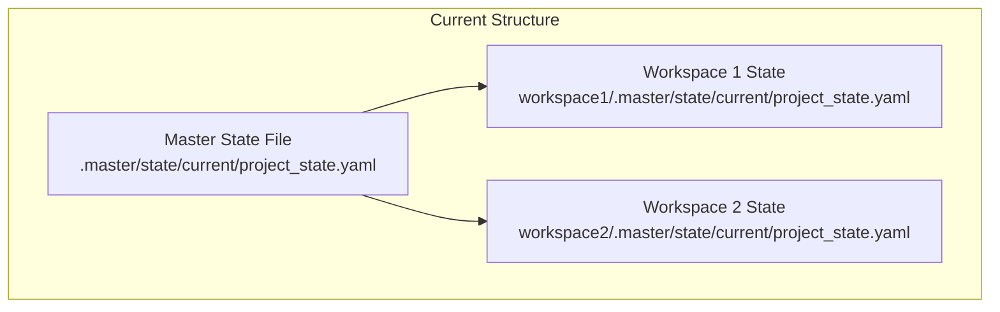
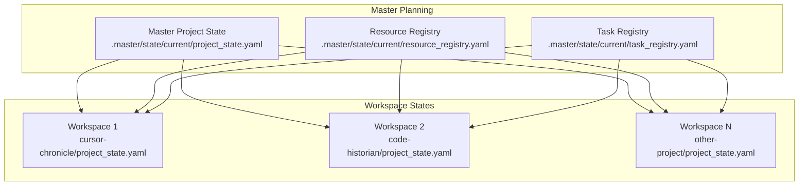
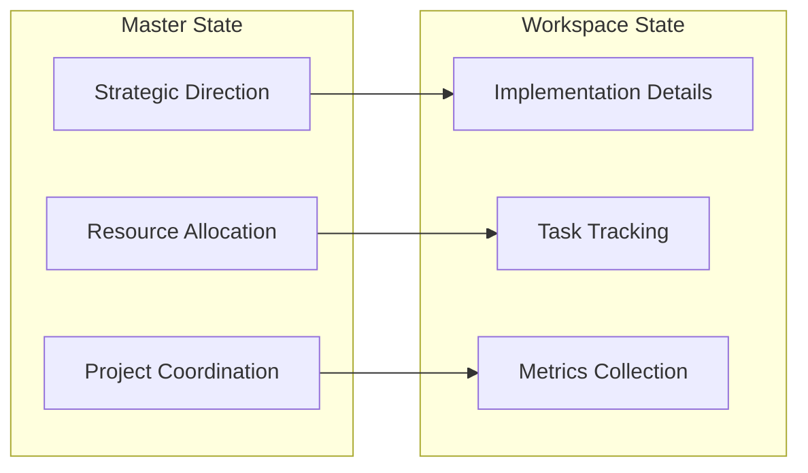
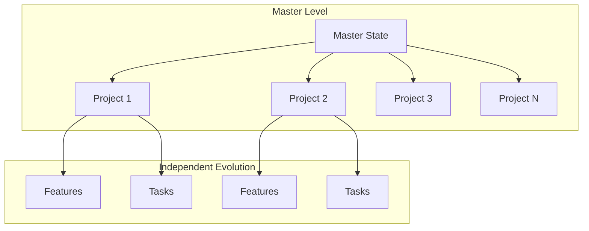
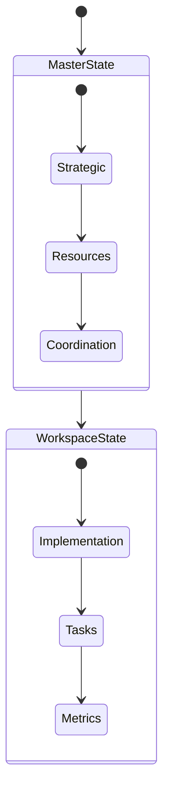
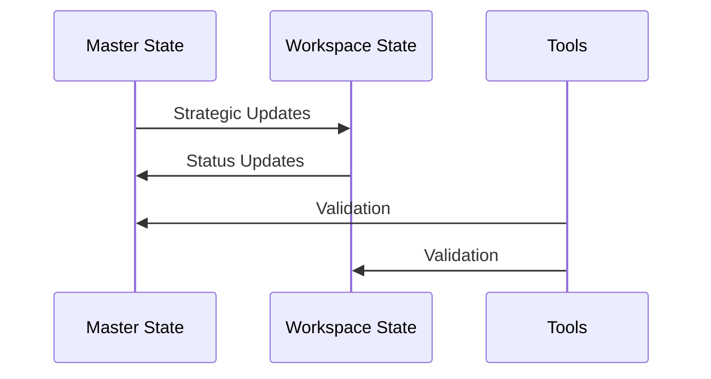

# State Management Hierarchy Analysis

## Current State



## Proposed Hierarchy



## Arguments for Separation

### 1. Clear Separation of Concerns


#### Benefits:
- Strategic decisions remain at master level
- Implementation details stay workspace-specific
- Clear ownership of different concerns
- Reduced coupling between workspaces

#### Challenges:
- Need to maintain synchronization
- Potential for divergence
- More complex state management

### 2. Scalability Advantages



#### Benefits:
- Each workspace can evolve independently
- Easier to add new workspaces
- Better performance (smaller state files)
- Simplified conflict resolution

#### Challenges:
- Need for cross-workspace coordination
- More complex tooling requirements
- Additional overhead in setup

### 3. Enhanced Flexibility



#### Benefits:
- Workspaces can adopt custom workflows
- Easier to experiment with new approaches
- Better support for different project types
- More granular control

#### Challenges:
- Potential for workflow divergence
- Need for standardization
- More complex documentation needs

## Proposed Structure

### Master State Files
```yaml
# .master/state/current/project_state.yaml
version: 1.0.0
strategic_direction:
  goals:
    - Cross-project integration
    - Unified tooling
  priorities:
    - Resource optimization
    - Knowledge sharing
workspaces:
  active:
    - cursor-chronicle
    - code-historian
  planned:
    - future-projects
resource_allocation:
  shared_resources:
    - Templates
    - Tools
    - Libraries
```

### Workspace State Files
```yaml
# cursor-chronicle/project_state.yaml
version: 1.0.0
workspace:
  name: cursor-chronicle
  type: integration
implementation:
  current_phase: development
  active_tasks:
    - UI integration
    - State management
metrics:
  coverage: 85%
  completion: 60%
```

## Implementation Strategy

### 1. State Synchronization


### 2. Tool Support
- State validators
- Sync utilities
- Metric collectors
- Report generators

### 3. Migration Path
1. Create master state structure
2. Move strategic content up
3. Refine workspace states
4. Implement tooling
5. Validate and adjust

## Recommendations

1. **Master State Focus**
   - Strategic direction
   - Resource allocation
   - Cross-project coordination
   - Shared standards
   - Global metrics

2. **Workspace State Focus**
   - Implementation details
   - Task tracking
   - Local metrics
   - Team workflows
   - Daily operations

3. **Tooling Requirements**
   - State validation
   - Sync mechanisms
   - Metric collection
   - Report generation
   - Conflict resolution

## Next Steps

1. **Phase 1: Structure**
   - [ ] Create master state hierarchy
   - [ ] Define workspace state template
   - [ ] Document relationships
   - [ ] Set up validation rules

2. **Phase 2: Migration**
   - [ ] Move strategic content to master
   - [ ] Refine workspace states
   - [ ] Update documentation
   - [ ] Validate relationships

3. **Phase 3: Tooling**
   - [ ] Implement validators
   - [ ] Create sync utilities
   - [ ] Set up metrics
   - [ ] Build reporting

4. **Phase 4: Validation**
   - [ ] Test with real data
   - [ ] Gather feedback
   - [ ] Refine approach
   - [ ] Document learnings

## Conclusion

The separation of master and workspace state files offers significant advantages in terms of scalability, flexibility, and clarity. While it introduces some complexity in terms of synchronization and tooling, the benefits of clear separation of concerns and improved maintainability outweigh these challenges.

Key success factors:
1. Strong tooling support
2. Clear documentation
3. Regular validation
4. Consistent enforcement
5. Team buy-in

This approach allows us to maintain strategic oversight while enabling workspace-specific innovation and efficiency. 