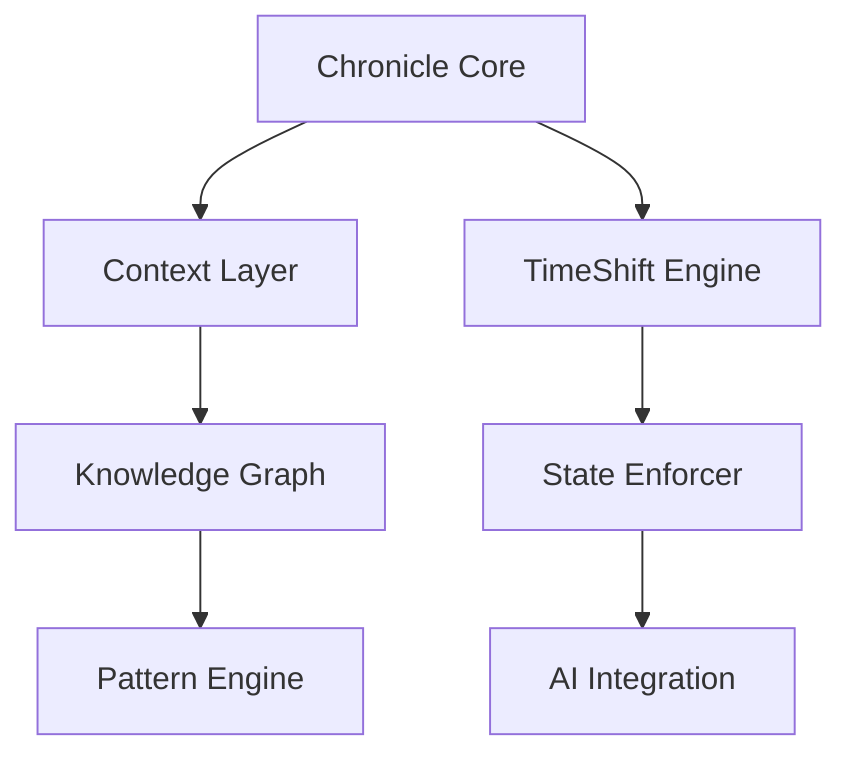
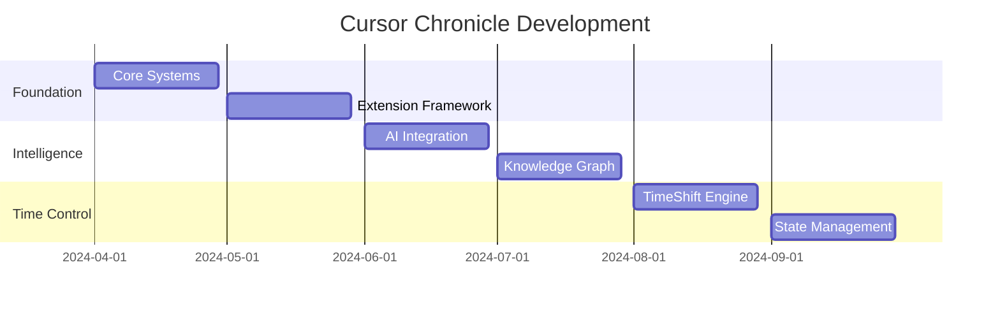

# Cursor Chronicle Master Plan

## Meta-Learning: Markdown-Driven Development (MDD) 📝

### Core Concept
```typescript
interface MarkdownDrivenDevelopment {
  // Living Documentation
  docs: {
    type: "executable" | "evolving" | "self-updating";
    format: "markdown";
    features: [
      "code blocks",
      "task tracking",
      "progress visualization",
      "knowledge preservation"
    ];
  };

  // Integration Points
  integration: {
    ide: "cursor";
    ai: "continuous assistance";
    vcs: "git";
    automation: "github actions";
  };

  // Benefits
  benefits: [
    "self-documenting",
    "ai-friendly",
    "human-readable",
    "version-controlled",
    "automation-ready"
  ];
}
```

### MDD Features to Implement
1. **Markdown Processing Engine**
   - [ ] Parse markdown as executable specs
   - [ ] Extract code blocks for testing
   - [ ] Generate progress metrics
   - [ ] Track task completion
   - [ ] Auto-update documentation

2. **AI-Markdown Integration**
   - [ ] AI-assisted markdown generation
   - [ ] Context-aware documentation
   - [ ] Smart formatting suggestions
   - [ ] Knowledge graph extraction
   - [ ] Pattern recognition in docs

3. **Documentation Automation**
   - [ ] Auto-sync with codebase
   - [ ] Progress bar generation
   - [ ] Status badge updates
   - [ ] Dependency tracking
   - [ ] Timeline visualization

## Implementation Roadmap 🗺️

### Phase 1: Foundation (April 2024)
1. **Core Systems**
   ```typescript
   // Core architecture
   interface ChronicleCore {
     fileSystem: VSCodeFS;
     contextLayer: ContextManager;
     aiIntegration: CursorAI;
     stateManager: StateEnforcer;
   }
   ```
   - Week 1-2: File system integration
   - Week 3-4: Context layer implementation

2. **Extension Framework**
   ```typescript
   // Extension structure
   class ChronicleExtension {
     private core: ChronicleCore;
     private ui: WebviewUI;
     private ai: AIManager;
     
     async activate(context: ExtensionContext) {
       await this.initializeComponents();
       await this.registerCommands();
       await this.startServices();
     }
   }
   ```
   - Week 5-6: Basic extension setup
   - Week 7-8: Command registration

### Phase 2: Intelligence (May 2024)
1. **AI Integration**
   ```typescript
   interface AICapabilities {
     conversation: ConversationManager;
     contextAnalysis: ContextAnalyzer;
     patternDetection: PatternEngine;
   }
   ```
   - Week 9-10: Conversation tracking
   - Week 11-12: Pattern detection

2. **Knowledge Graph**
   ```typescript
   class KnowledgeGraphManager {
     private graph: Graph;
     private visualizer: WebviewPanel;
     
     async visualize() {
       await this.visualizer.render(this.graph);
     }
   }
   ```
   - Week 13-14: Graph implementation
   - Week 15-16: Visualization system

### Phase 3: Time Control (June 2024)
1. **TimeShift Engine**
   ```typescript
   interface TimeShiftCapabilities {
     blockLevel: BlockShifter;
     fileLevel: FileShifter;
     projectLevel: ProjectShifter;
   }
   ```
   - Week 17-18: Block-level shifts
   - Week 19-20: Project-wide shifts

2. **State Management**
   ```typescript
   class StateEnforcer {
     private validator: Validator;
     private enforcer: Enforcer;
     
     async enforceState(state: State) {
       await this.validator.validate(state);
       await this.enforcer.enforce(state);
     }
   }
   ```
   - Week 21-22: State validation
   - Week 23-24: Enforcement system

## Architecture Overview 🏗️

### Component Interaction


### Data Flow
```typescript
interface DataFlow {
  input: {
    fileChanges: FileSystemEvent[];
    userActions: EditorEvent[];
    aiResponses: AIResponse[];
  };
  
  processing: {
    contextExtraction: ContextProcessor;
    patternDetection: PatternProcessor;
    stateValidation: StateProcessor;
  };
  
  output: {
    timelineUpdates: TimelineEvent[];
    knowledgeGraphUpdates: GraphEvent[];
    uiUpdates: UIEvent[];
  };
}
```

## Innovation Tracking 🚀

### Current Breakthroughs
1. **Markdown-Driven Development**
   - Self-documenting systems
   - Living documentation
   - AI-friendly format
   - Progress visualization

2. **Meta-Development**
   - Self-referential tooling
   - Context preservation
   - Knowledge synthesis
   - Pattern recognition

### Next Horizons
1. **AI-Enhanced Documentation**
   - Auto-generated insights
   - Context-aware updates
   - Pattern-based organization
   - Knowledge preservation

2. **Time-Aware Development**
   - Context preservation
   - State management
   - Evolution tracking
   - Pattern recognition

## Success Metrics 📊

### Development Velocity
| Metric | Current | Target | Status |
|--------|---------|--------|--------|
| Context Switch Time | 5min | 30sec | 🟨 |
| Pattern Recognition | Manual | Auto | 🟥 |
| Knowledge Retention | 20% | 95% | 🟥 |
| Documentation Accuracy | 60% | 99% | 🟨 |

### Quality Metrics
| Metric | Current | Target | Status |
|--------|---------|--------|--------|
| Context Preservation | 30% | 95% | 🟥 |
| Pattern Coverage | 40% | 90% | 🟨 |
| Knowledge Synthesis | 15% | 85% | 🟥 |
| Time Travel Accuracy | 50% | 99% | 🟨 |

## Resource Allocation 📑

### Team Structure
```typescript
interface TeamStructure {
  core: {
    architects: Developer[];
    aiSpecialists: AIEngineer[];
    uiEngineers: UIEngineer[];
  };
  
  support: {
    documentation: TechWriter[];
    testing: QAEngineer[];
    devOps: DevOpsEngineer[];
  };
}
```

### Timeline


## Risk Management 🛡️

### Technical Risks
1. **Performance**
   - Risk: Extension host limitations
   - Mitigation: Distributed processing
   - Monitoring: Performance metrics

2. **Stability**
   - Risk: State corruption
   - Mitigation: Robust validation
   - Monitoring: Error rates

### Innovation Risks
1. **Complexity**
   - Risk: Feature overload
   - Mitigation: Phased rollout
   - Monitoring: Usage metrics

2. **Integration**
   - Risk: API limitations
   - Mitigation: Fallback strategies
   - Monitoring: API usage

## Next Actions 📋

### Immediate (Next 2 Weeks)
1. [ ] Set up development environment
2. [ ] Create basic extension structure
3. [ ] Implement file monitoring
4. [ ] Design context layer

### Short Term (Next Month)
1. [ ] Build AI integration
2. [ ] Create knowledge graph
3. [ ] Implement basic time travel
4. [ ] Set up state management

### Medium Term (Next Quarter)
1. [ ] Complete TimeShift engine
2. [ ] Enhance pattern recognition
3. [ ] Improve knowledge synthesis
4. [ ] Optimize performance

The journey to revolutionize development continues... 🚀 