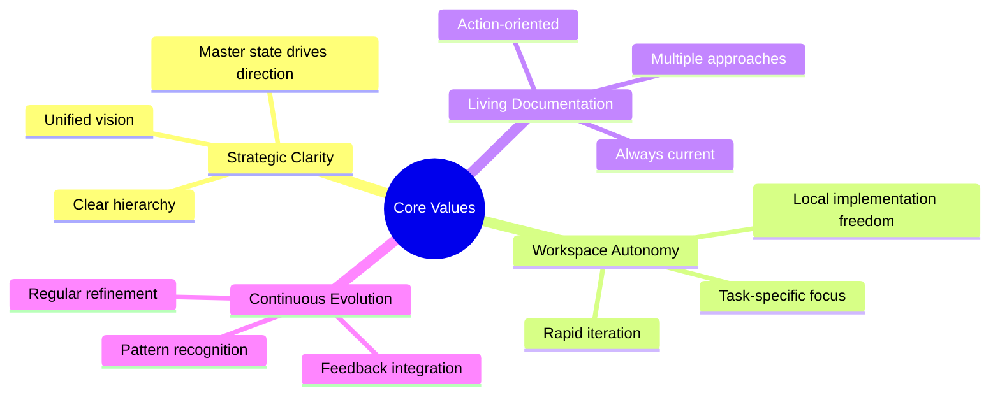
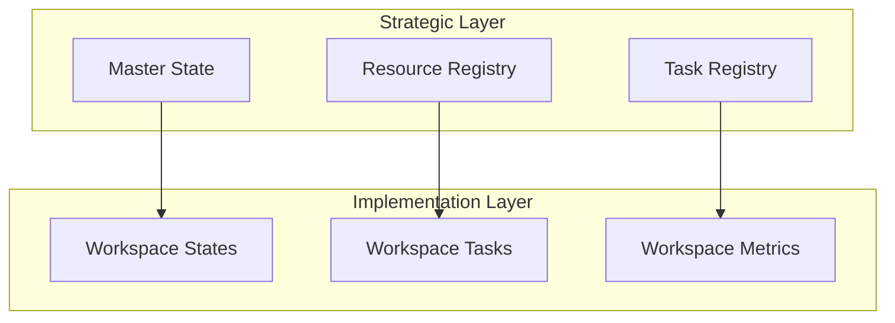
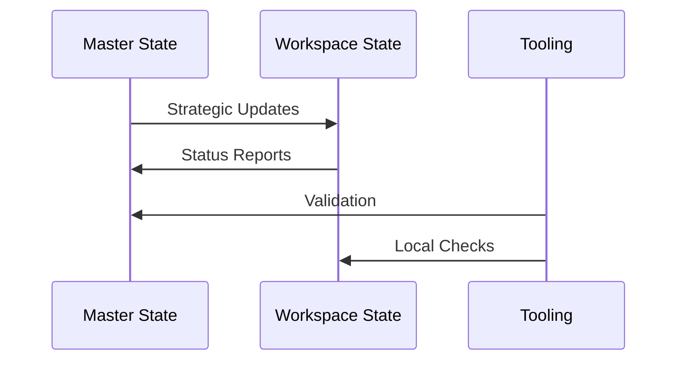
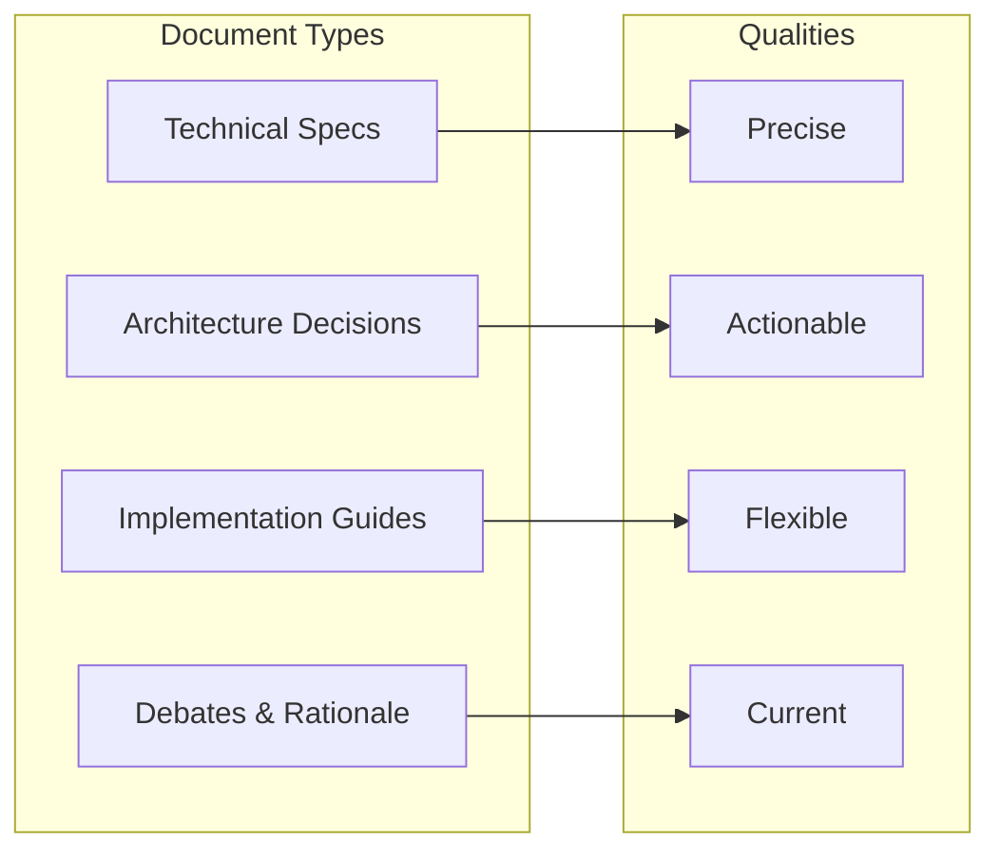
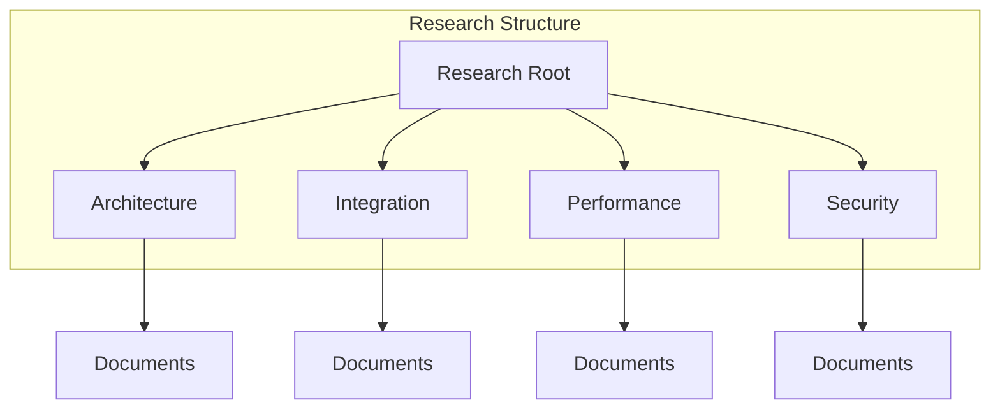
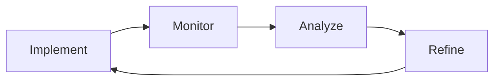

# Project Philosophy & Principles

## Core Values

## State Management Philosophy

### Hierarchical State Model

1. **Master State Principles**

   - Single source of truth for strategic direction
   - Cross-project coordination hub
   - Resource allocation authority
   - Global standards definition

2. **Workspace State Principles**

   - Implementation autonomy
   - Local task ownership
   - Metric collection point
   - Innovation sandbox

### Documentation Standards

1. **Living Documents**

   - Always reflect current state
   - Include actionable steps
   - Maintain historical context
   - Link to related resources

2. **Technical Precision**

   - Concrete examples
   - Clear rationale
   - Multiple approaches
   - Implementation guidance

3. **Integration Focus**

   - Clear interfaces
   - Flexible approaches
   - Documented tradeoffs
   - Migration paths

## Implementation Guidelines

### 1. State File Management

- Always check master state for context
- Maintain workspace-specific details locally
- Regular synchronization
- Clear validation rules

### 2. Documentation Approach

- Technical precision with examples
- Multiple implementation paths
- Clear decision rationale
- Regular updates

### 3. Research Organization

- Organized by domain
- Clear linking
- Version tracked
- Regular synthesis

## Operational Rules

1. **State Management**

   - Check master state before tasks
   - Keep states synchronized
   - Track decisions with rationale
   - Maintain clear hierarchy

2. **Documentation**

   - Always actionable
   - Technically precise
   - Multiple approaches
   - Include debates

3. **Research**

   - Proper categorization
   - Clear linking
   - Regular updates
   - Pattern recognition

## Evolution Strategy

### Continuous Improvement

1. **Implementation**

   - Follow established patterns
   - Document decisions
   - Track metrics
   - Maintain consistency

2. **Monitoring**

   - Regular validation
   - Metric collection
   - Pattern detection
   - Issue tracking

3. **Analysis**

   - Pattern evaluation
   - Performance review
   - Integration assessment
   - Documentation audit

4. **Refinement**

   - Pattern updates
   - Process improvements
   - Documentation updates
   - Tool enhancements

## Success Metrics

1. **State Management**

   - Synchronization accuracy
   - Update frequency
   - Decision coverage
   - Implementation tracking

2. **Documentation**

   - Technical accuracy
   - Implementation success
   - Update frequency
   - Usage metrics

3. **Research**

   - Pattern discovery
   - Implementation impact
   - Knowledge sharing
   - Innovation metrics

## Conclusion

This philosophy emphasizes clear hierarchy, workspace autonomy, and living documentation while maintaining strategic alignment through master state coordination. Success depends on consistent application of these principles, regular validation, and continuous evolution based on practical experience.