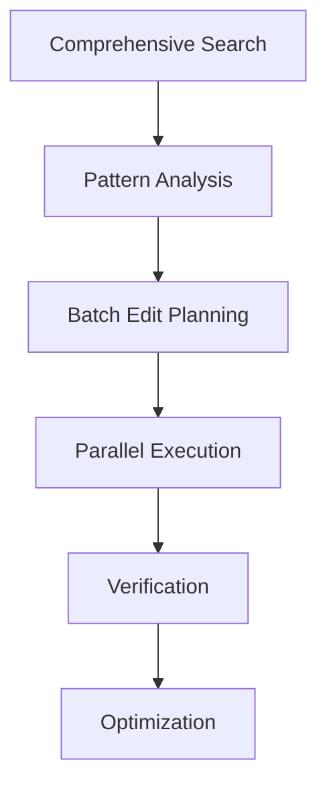
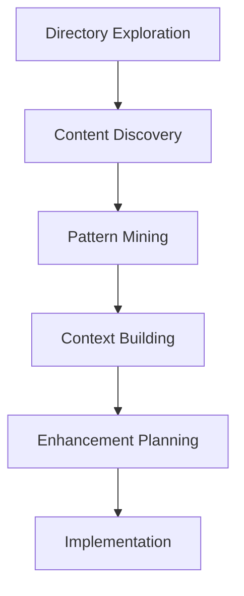

# Tool Utilization Implementation Guide

## Current Tool Analysis 🔍

### Available Tools
```typescript
interface ToolSet {
  fileOperations: {
    read_file: (params) => Promise<string>;
    edit_file: (params) => Promise<void>;
    delete_file: (params) => Promise<void>;
  };
  
  searchOperations: {
    grep_search: (params) => Promise<Result[]>;
    semantic_search: (params) => Promise<Result[]>;
    file_search: (params) => Promise<string[]>;
  };
  
  directoryOperations: {
    list_dir: (params) => Promise<string[]>;
  };
  
  executionOperations: {
    run_terminal_cmd: (params) => Promise<Result>;
  };
}
```

### Usage Patterns Matrix
| Tool | Current Usage | Optimal Usage | Gap |
|------|--------------|---------------|-----|
| read_file | Sequential | Parallel batches | 🟨 |
| edit_file | Single edits | Batch edits | 🟥 |
| grep_search | Limited scope | Multi-pattern | 🟨 |
| list_dir | Surface level | Deep exploration | 🟥 |
| run_terminal_cmd | Basic commands | Advanced pipelines | 🟨 |

## Optimization Strategies 🎯

### Tool Combinations
```typescript
interface ToolCombinations {
  search: {
    pattern: [
      "grep_search → read_file → edit_file",
      "file_search → list_dir → grep_search",
      "semantic_search → read_file → grep_search"
    ];
    benefit: "comprehensive_discovery";
  };
  
  modification: {
    pattern: [
      "read_file → edit_file → run_terminal_cmd",
      "grep_search → parallel_edit → run_terminal_cmd",
      "list_dir → batch_edit → verification"
    ];
    benefit: "efficient_changes";
  };
  
  analysis: {
    pattern: [
      "list_dir → deep_search → pattern_analysis",
      "grep_search → content_analysis → optimization",
      "semantic_search → context_building → enhancement"
    ];
    benefit: "deep_understanding";
  };
}
```

### Implementation Patterns

1. **Search Enhancement**
   ```typescript
   class SearchOptimizer {
     private searchTools: SearchTools[];
     
     async comprehensiveSearch(query: string): Promise<Result[]> {
       const searches = this.searchTools.map(tool => 
         tool.search(query)
       );
       return Promise.all(searches);
     }
     
     async deepAnalysis(results: Result[]): Promise<Analysis> {
       return this.analyzer.processResults(results);
     }
   }
   ```

2. **Edit Orchestration**
   ```typescript
   class EditOrchestrator {
     private editQueue: Edit[];
     
     async batchProcess(edits: Edit[]): Promise<void> {
       const batches = this.optimizeBatches(edits);
       for (const batch of batches) {
         await this.parallelExecute(batch);
       }
     }
   }
   ```

## Success Patterns 🎯

### Search-Edit-Verify Pattern


### Deep Analysis Pattern


## Implementation Checklist 📋

### Tool Usage Enhancement
- [ ] Implement parallel search execution
- [ ] Create batch edit processor
- [ ] Build verification system
- [ ] Develop pattern detector
- [ ] Set up optimization tracker

### Process Optimization
- [ ] Design tool combination templates
- [ ] Create usage pattern library
- [ ] Implement success metrics
- [ ] Build feedback system
- [ ] Establish verification loops

### Context Management
- [ ] Implement state tracking
- [ ] Create progress markers
- [ ] Build completion verifier
- [ ] Design pattern matcher
- [ ] Set up optimization triggers

## Verification System 🔍

### Completion Criteria
```typescript
interface CompletionCriteria {
  search: {
    coverage: number;      // % of codebase searched
    depth: number;         // Levels of analysis
    patterns: number;      // Patterns discovered
  };
  
  modification: {
    accuracy: number;      // % of correct changes
    efficiency: number;    // Changes per operation
    verification: number;  // % of verified changes
  };
  
  optimization: {
    toolCoverage: number; // % of tools utilized
    combinations: number; // Tool combinations used
    effectiveness: number; // Impact of changes
  };
}
```

### Success Metrics
| Category | Metric | Target |
|----------|--------|---------|
| Search | Coverage | 95% |
| Search | Depth | Level 3+ |
| Edit | Accuracy | 99% |
| Edit | Batch Size | 10+ |
| Tools | Utilization | 90% |
| Tools | Combinations | 5+ |

## Next Steps 🚀

### Immediate Implementation
1. [ ] Set up tool usage tracking
2. [ ] Implement parallel search
3. [ ] Create batch edit system
4. [ ] Build verification loop

### Medium Term
1. [ ] Pattern library development
2. [ ] Optimization engine
3. [ ] Context preservation
4. [ ] Success metric tracking

### Long Term
1. [ ] Autonomous optimization
2. [ ] Self-improving patterns
3. [ ] Perfect tool utilization
4. [ ] Context mastery

## Meta-Learning 🧠

This implementation guide should be:
1. Continuously refined
2. Pattern-optimized
3. Tool-utilizing
4. Self-improving

The path to optimal tool utilization is itself a journey of continuous improvement... 🚀 